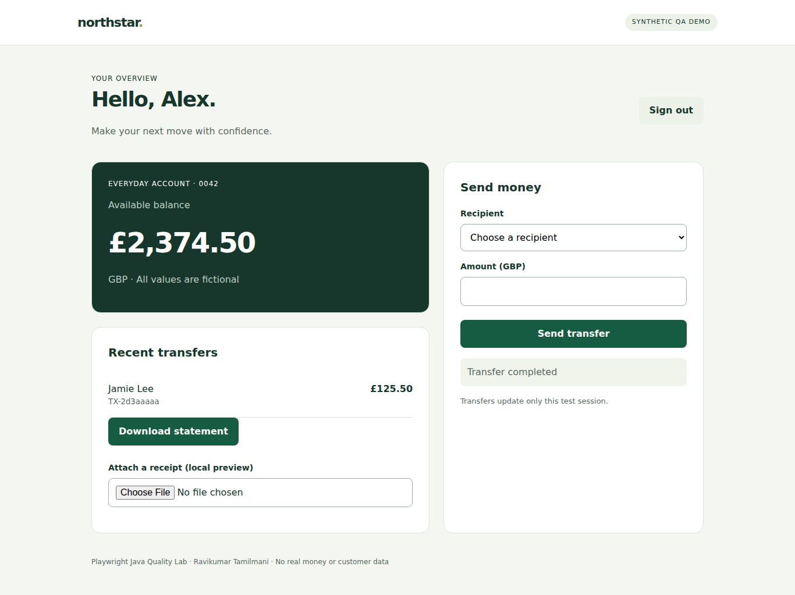

# Playwright Java Quality Lab

[](https://github.com/ravitamil/playwright-java-quality-lab/actions/workflows/quality.yml)

**UI + API automation with evidence you can inspect.** A practical Java quality-engineering showcase by [Ravikumar Tamilmani](https://github.com/ravitamil), built around a local, fictional banking application. No third-party demo website, real banking system, paid service, credentials or customer data is required.

This project demonstrates test design, business assertions, isolation, parallel execution and debugging—not only page-object syntax. The demo deliberately stays small so the quality-engineering decisions remain visible.



## Explore the evidence

- [Evidence gallery and recorded demonstration](docs/evidence/README.md)
- [Actual Extent Spark report](docs/evidence/passing/extent-report.html) — download/serve the evidence folder to open HTML; GitHub's file viewer does not render reports.
- [Framework architecture and tradeoffs](docs/architecture.md)
- [Test coverage and risk mapping](docs/test-strategy.md)
- [GitHub Actions](https://github.com/ravitamil/playwright-java-quality-lab/actions) — full per-browser evidence is uploaded even when tests fail.

## What is implemented

| Capability | Where to inspect it |
| --- | --- |
| UI and API assertions in one flow | `transferUpdatesUiAndApi`: recipient, debit, transaction and REST response |
| Data-driven negative testing | invalid credentials, insufficient funds and currency precision |
| Idempotency and duplicate-payment protection | repeated requests debit once; changed payload with same key returns 409 |
| Authentication reuse | in-memory Playwright storage state loaded into a fresh context |
| Session revocation | logout rejects subsequent account API access |
| Network control | route a 503 outage, verify unchanged balance, remove mock and prove recovery |
| Download and upload handling | verify downloaded CSV contents; attach synthetic receipt to local preview |
| Mobile and keyboard checks | 390px viewport, overflow assertion and keyboard-only sign-in |
| Safe parallel execution | independent app, Playwright, browser and context for each invocation |
| Diagnostics | screenshot, WebM video, trace ZIP, console log, API network log and result JSON |
| ExtentReports integration | status, exception, screenshots and relative links to videos/traces/logs |
| Cross-browser CI | Chromium, Firefox, WebKit matrix on Java 17 |

## Run it

Requires JDK 17+ and Maven 3.9+. Dependencies and browser binaries require internet during installation. Tests run against localhost afterwards.

```sh
git clone https://github.com/ravitamil/playwright-java-quality-lab.git
cd playwright-java-quality-lab
mvn -B -ntp test-compile
mvn exec:java -Dexec.mainClass=com.microsoft.playwright.CLI -Dexec.args="install chromium"
mvn test
```

PowerShell: quote Maven `-D` arguments, especially the one containing spaces:

```powershell
mvn exec:java '-Dexec.mainClass=com.microsoft.playwright.CLI' '-Dexec.args=install chromium'
mvn test '-Dbrowser=chromium' '-Dthreads=2'
```

Use `install --with-deps chromium` on Linux machines without browser system dependencies. For Firefox or WebKit, install the matching browser and pass `-Dbrowser=firefox` or `-Dbrowser=webkit`.

### Configuration

| Property | Default | Behavior |
| --- | --- | --- |
| `browser` | `chromium` | `chromium`, `firefox`, `webkit` |
| `headless` | `true` | `false` shows a browser for debugging |
| `threads` | `2` | TestNG method worker count |
| `artifacts` | `all` | `failure` retains diagnostics only for failed tests |
| `artifactDir` | `target/evidence` | report/evidence destination; use a different folder for each run |
| `browserExecutable` | unset | optional local diagnostic override; standard CI uses the Playwright-matched browser |

```sh
mvn test -Dgroups=smoke
mvn test -Dgroups=api
mvn test -Dbrowser=firefox -Dthreads=4
mvn test -Dartifacts=failure
```

Do not combine API objects or pages across threads. Playwright Java is not thread-safe; each worker owns its full lifecycle here. There are no fixed sleeps or automatic retries to hide failures.

## Debug a failure

Open `target/evidence/extent-report.html`. Each invocation has a unique folder containing its screenshot, trace, video and logs. Serve the folder for browser-safe relative media links:

```sh
python -m http.server 8000 --directory target/evidence
```

Then open `http://localhost:8000/extent-report.html`.

Open a trace with Playwright's CLI (replace the folder with an actual test directory):

```sh
mvn exec:java -Dexec.mainClass=com.microsoft.playwright.CLI -Dexec.args="show-trace target/evidence/TEST-FOLDER/trace.zip"
```

Or drop a trace into [Playwright Trace Viewer](https://trace.playwright.dev/). Inspect action timeline, DOM snapshots, screenshots, requests and console details. Raw Java tracing records browser activity; Java assertion failures are reported separately in Extent/TestNG. Trace Viewer itself is provided by Microsoft Playwright, not implemented by this repository.

### Intentional failure demonstration

```sh
mvn test -Pfailure-demo -DartifactDir=target/failure-demo
```

This deliberately compares £2,500.00 against £9,999.00 and **must exit nonzero**. It is excluded from the normal suite and CI. Its purpose is to prove that a real failed assertion produces useful artifacts, not to manufacture a green build. See the committed [failure evidence](docs/evidence/failure/extent-report.html).

## Boundaries

The fixture is original synthetic demo code, not a production banking architecture or proof of testing an employer's product. Receipt attachment demonstrates browser file-input handling and local preview; it does not implement server-side document storage. Keyboard and responsive checks are targeted functional tests, not a complete WCAG audit. Screenshots are diagnostic evidence, not pixel-baseline visual regression assertions. Synthetic sessions/cookies in sample traces are local demo data; never publish traces, HARs or storage state containing real secrets.

Created with AI-assisted implementation and verified through executed tests. Review the code and adapt it before using it in a production test suite.

## References

[Playwright Java docs](https://playwright.dev/java/docs/intro) · [Test runners](https://playwright.dev/java/docs/test-runners) · [Tracing](https://playwright.dev/java/docs/trace-viewer) · [Video finalization](https://playwright.dev/java/docs/videos) · [Extent Spark](https://www.extentreports.com/docs/versions/5/java/spark-reporter.html)

Connect: [Portfolio](https://ravitamil.github.io/) · [LinkedIn](https://www.linkedin.com/in/ravikumar-tamilmani-095a85146/)
