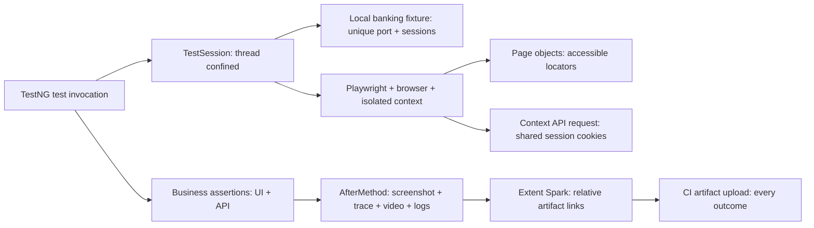

# Architecture and tradeoffs

## Ownership

`BaseTest` stores a `TestSession` per worker using `ThreadLocal`. A method invocation owns its local server, Playwright, browser, context and page. The local server binds only to 127.0.0.1 on an available port. Tests neither share accounts nor depend on execution order. The Extent report alone is shared; its creation and flush are serialized, and each invocation writes to its own `ExtentTest`.

## Evidence lifecycle

1. Start tracing and video when the test context is created.
2. Execute tests with web-first Playwright assertions.
3. Capture the final page screenshot and stop tracing.
4. Close the context to finalize WebM video.
5. Write logs and result metadata; attach relative links to the report.
6. Release browser, Playwright and local server.

With `artifacts=failure`, diagnostics are recorded during the test but successful-test evidence is removed after completion. This reduces retained storage; it does not eliminate recording overhead. The HTML report is retained. Artifact-capture errors fail teardown so missing evidence is not quietly represented as successful capture.

## Deliberate choices

- A local fixture provides deterministic transactions and fault injection without depending on public-site availability. It also limits the realism of browser/network/auth scenarios.
- New browsers per test favor clear isolation and thread ownership over maximum execution speed. A worker-scoped browser optimization would need explicit lifecycle and cleanup proof.
- Monetary calculations use `BigDecimal` on the server. Business assertions verify values and transaction counts, rather than asserting only HTTP 200.
- UI locators prefer roles/labels; a test ID selects the balance value. There is no generic locator utility layer that hides Playwright.
- No retry analyzer: an unexpected failure remains visible. CI uses fail-fast false so all browser results are preserved.
- No production credentials, secret scanning bypass, or external banking endpoints.
- ExtentReports is an explicitly requested third-party dependency. Its report UI/CDN behavior is separate from the test runner; the checked-in evidence can be inspected without rerunning tests.

## Source map

`demo/BankingDemo.java` and `resources/demo/index.html`: fixture and UI.

`framework/`: configuration, resource ownership, artifact capture and reporting.

`pages/`: reusable domain interactions.

`tests/`: risk-based scenarios and optional failure demo.

`.github/workflows/quality.yml`: browser matrix, Java setup and artifact retention.
